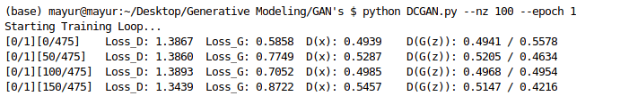
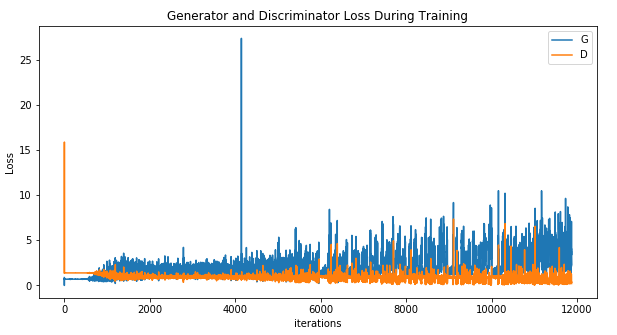

### **GAN Implementation**

### **Camel Dataset**
  
  [Camel Dataset](https://console.cloud.google.com/storage/browser/quickdraw_dataset/full/numpy_bitmap;tab=objects?pli=1&prefix=)

### **Execution**

  
### **Plot**

  
### **Result**

  [GAN's Result]('Images/gans_result.png')
