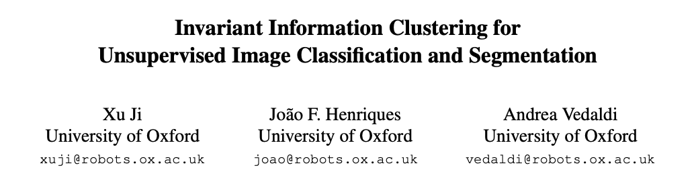

## [**Original Paper**](https://arxiv.org/abs/1807.06653)

## **Model Set-Up**

  

## **MNIST Result**

  

**Tags:** [**Entropy Maximization**](https://en.wikipedia.org/wiki/Principle_of_maximum_entropy), [**Conditional Entropy Maximization**](https://en.wikipedia.org/wiki/Conditional_entropy), [**Bottleneck**](https://ai.stackexchange.com/questions/4864/what-is-the-concept-of-tensorflow-bottlenecks), [**Biclustering**](https://en.wikipedia.org/wiki/Biclustering), [**Spatio-Temporal**](https://www.omnisci.com/technical-glossary/spatial-temporal), 
[**Geometric Transformation**](https://en.wikipedia.org/wiki/Geometric_transformation), [**Mutual Information**](https://en.wikipedia.org/wiki/Mutual_information), [**Joint Entropy**](https://en.wikipedia.org/wiki/Joint_entropy), [**Joint Distribution**](https://en.wikipedia.org/wiki/Joint_probability_distribution)
